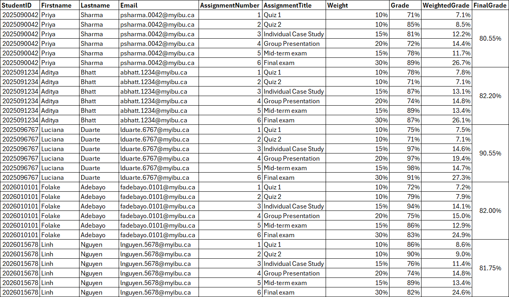
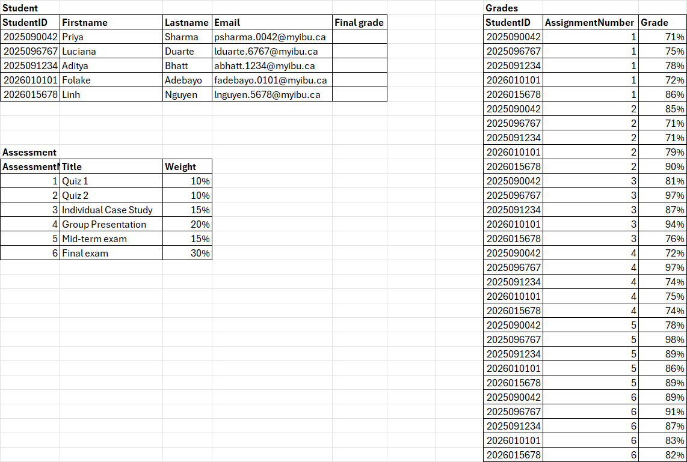

# SQL Introduction

Welcome to this Introduction to SQL as part of Prof. Kobra's Technology Trends and Applications course at IBU!

This document gives you an overview of what you can do with SQL, and while you can just read it on its own, you can also follow the steps yourself at no cost.

## 1. Basic Concepts

The most common way to store information on computers is using relational database tables. This uses the techniques of [Entity-Relationship modelling](https://en.wikipedia.org/wiki/Entity%E2%80%93relationship_model) to define tables that store information, what their attributes are, and what the relationships among them are. We can then use concepts of [Relational Algebra](https://en.wikipedia.org/wiki/Relational_algebra) to inspect and manipulate this data.

For example, think about this course, everyone taking this course, and the various assignments you have to do. Let's assume the following:
 - each student has a firstname, lastname and an email
 - there are 6 assessments in the course, each with a different title and a weight
 - each student gets graded on each of the 6 assignments and gets a final grade
 
If we captured all of this in an Excel spreadsheet, it would look like this:


But now we're repeating the student names and the assignment titles and grades. What if Prof. Kobra wanted to change the weights of the assignments? How do we track that the course has multiple grades - one per student, per assessment?? 🤔

We can break this into three Entities - Course, Student, and Assessment.


Now the data is no longer duplicated, but how do we manage this data and combine it back together? 😱

This is the power of SQL!

## 2. What is SQL?

Structured Query Language (SQL) is a programming language for defining and manipulating relational data. SQL is subcategorized into three main forms:
* DDL - Data Definition Language
* DCL - Data Control Language
* DML - Data Manipulation Language (sometimes split into DML + DQL)

## 3. DDL - Data Definition Language

Define, modify or manage a database's schema (its structure). For example, this include tables and other structural objects. 

Here are some example operations.

| SQL keyword | Effect |
| :---        | :---   |
| `CREATE`    | Create a new database object like a table or an index. |
| `ALTER`     | Modifies an existing database object, for example add columns to a table.     |
| `DROP`      | Delete a database object. |
| `TRUNCATE`  | Clears a database table, but leave its structure. |
 
## 4. DCL - Data Control Language

Control security and access to a database and its data. 

Here are some example operations.

| SQL keyword | Effect |
| :---        | :---   |
| `GRANT`     | Give permissions or a role (grouping of permissions) to a user. |
| `REVOKE`    | Revoke a permission or a role from a user.     |
| `DENY`      | Explicity ban specific privileges for a database object from a user. |

## 5. DML - Data Manipulation Language

Manipulate and query the actual data (not the structure). 

Here are some example operations.

| SQL keyword | Effect |
| :---        | :---   |
| `SELECT`    | Fetch data from the database tables that satisfies the given conditions. |
| `INSERT`    | Add data into a database table. |
| `UPDATE`    | Modify some data already present on the database that meets given conditions. |
| `DELETE`    | Delete some data that meets given conditions. |

Sometimes, the `SELECT` statement is considered to be a separate subcategory of "Data Query Language (DQL)".

## 6. Exercise 1 - creating a database server on Azure

This is an optional step that you can try on your own free of charge using the Microsoft Azure subscription that you get through IBU. See step-by-step instructions [here](./create-sql-server-instance-azure.md). 

## 7. Exercise 2 - creating a database on Azure

This is an optional step that builds on the previous step, that you can again try on your own free of charge. See step-by-step instructions [here](./create-azure-sql-db.md). 

## 8. Exercise 3 - creating data on the database

This is the third optional step where you can add data into the database from the previous step. See step-by-step instructions [here](./create-data-on-database.md).

## 9. Exercise 4 - querying data

The value of data is in turning facts into information with value. Here are several different ways to do this.

1. list all the Students

	```sql
	SELECT *
	FROM dbo.Student
	```

2. filter the students who got A's

	```sql
	SELECT *
	FROM dbo.Student
	WHERE FinalGrade >= 90
	```

3. list only the student names and email addresses

	```sql
	SELECT Firstname, Lastname, Email
	FROM dbo.Student
	```
		
4. list names, email addresses and grade of students who got an A

	```sql
	SELECT Firstname, Lastname, Email
	FROM dbo.Student
	WHERE FinalGrade >= 90
	```
				
5. list the name, email address and final exam grade of each student

	```sql
	SELECT Firstname, Lastname, Email, Grade
	FROM dbo.Student AS std, dbo.Grades grd
	WHERE std.StudentId = grd.StudentId
	AND grd.AssessmentNumber = '6'
	```

	alternatively

	```sql
	SELECT Firstname, Lastname, Email, Grade
	FROM dbo.Student AS student 
	JOIN dbo.Grades grades
	ON student.StudentId = grades.StudentId
	WHERE grades.AssessmentNumber = '6'
	```
		
6. list the average grade per assignment

	```sql
	SELECT AssessmentNumber, AVG(Grade)
	FROM dbo.Grades
	GROUP BY AssessmentNumber
	```

7. calculate the final grades of the students

	```sql
	SELECT
		s.StudentId,
		s.Firstname,
		s.Lastname,
		s.FinalGrade AS StoredFinalGrade,
		ROUND(SUM(g.Grade * a.Weight) * 100, 0) AS CalculatedFinalGrade
	FROM dbo.Student AS s, dbo.Grades g, dbo.Assessment a 
	WHERE g.StudentId = s.StudentId
		AND a.AssessmentNumber = g.AssessmentNumber
	GROUP BY
		s.StudentId,
		s.Firstname,
		s.Lastname,
		s.FinalGrade
	ORDER BY
		CalculatedFinalGrade DESC;
	```
	
8. Make the final exam 25% of the final grade, and the individual case study 20%.

	```sql
	UPDATE dbo.Assessment
	SET Weight = 0.25 WHERE AssessmentNumber = '6';
	UPDATE dbo.Assessment
	SET Weight = 0.20 WHERE AssessmentNumber = '3';
	```

9. Recalculate final grades
