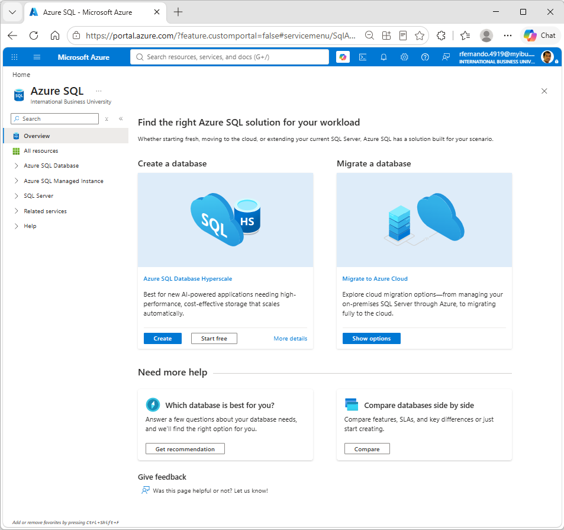
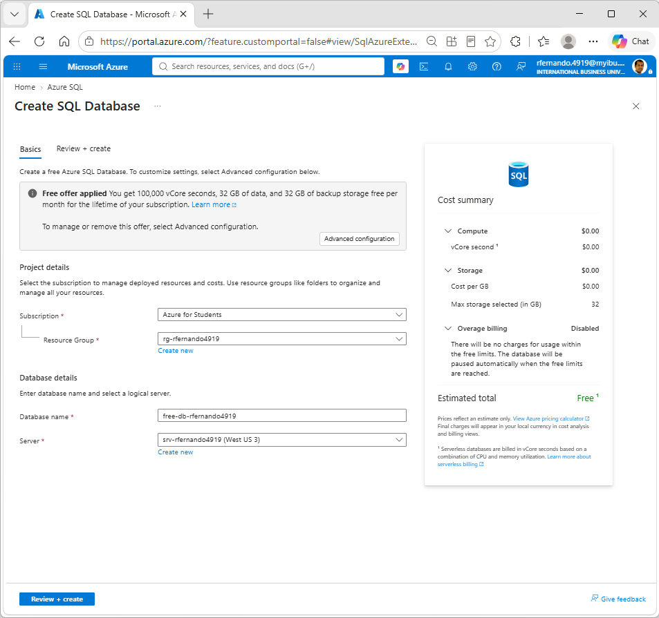
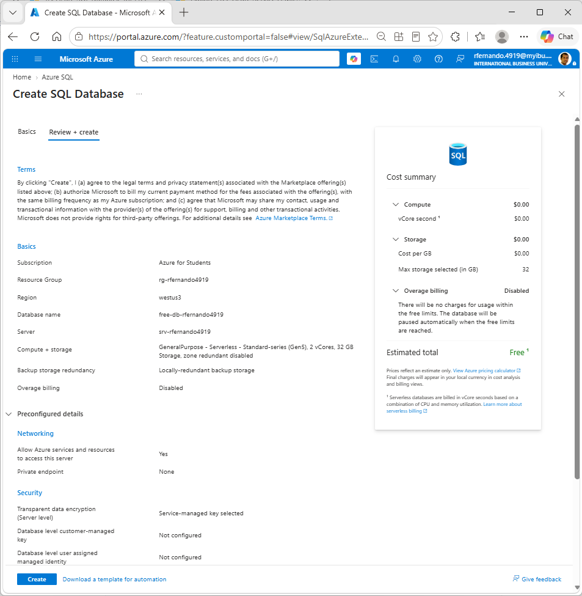
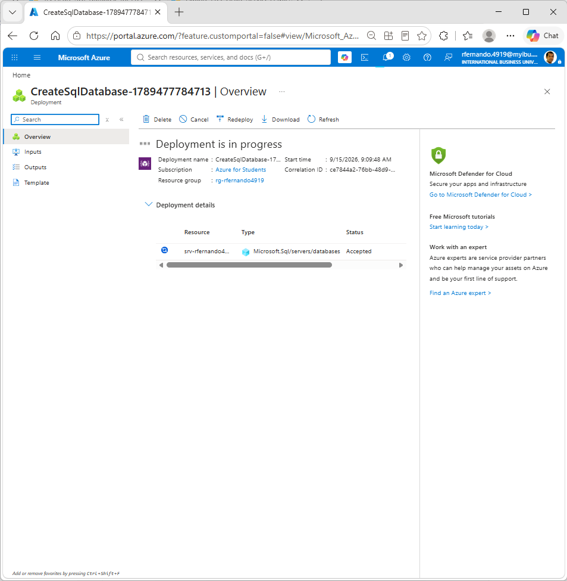

# Create an Azure SQL database instance

Note: this is a second optional step that you can try on your own free of charge once you have [created a SQL Server instance on Azure](./create-sql-server-instance-azure.md).

Use the same naming convention here as well and replace with your details wherever a name contains `jsmith1234`.

1. Ensure you are logged in to [https://portal.azure.com](https://portal.azure.com) with your IBU student credentials. Open a new tab and visit [https://aka.ms/azuresqlhub](https://aka.ms/azuresqlhub) and click on the `Start free` option.

2. Ensure you see `Free offer applied` as in the below screenshot. Pick the subscription, resource group and server from the [previous exercise](./create-sql-server-instance-azure.md). Enter a name for your database and once again ensure that in the `Cost summary` section, the `Estimated total` shows as `Free`.

3. In the review screen, double check the settings and click `Create` to start deploying the database. 

4. Wait for the deployment to complete.

