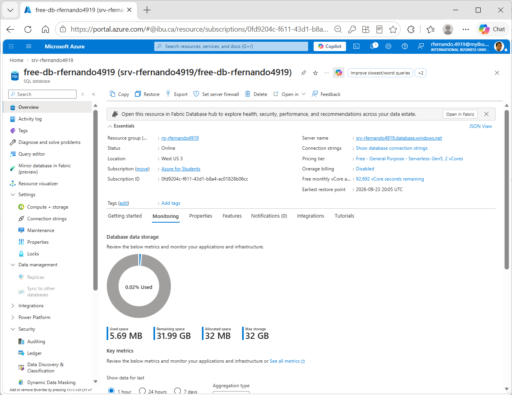
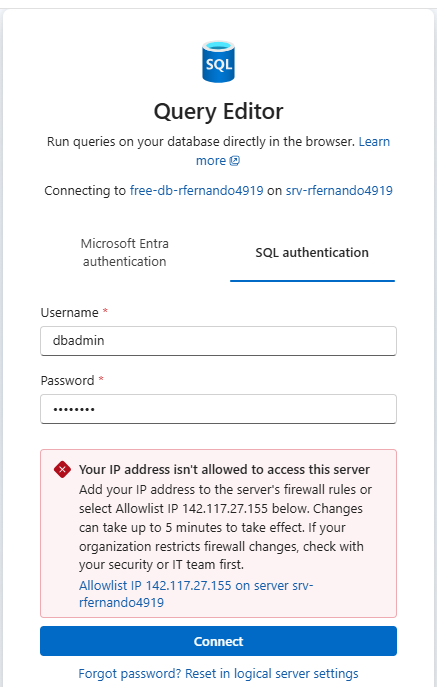

# Exercise 3: Creating data on the database

Go back to [main](./README.md#8-exercise-3---creating-data-on-the-database).

Note: this is a third optional step that you can try on your own free of charge once you have [created a SQL Server instance on Azure](./create-sql-server-instance-azure.md) and then [created an Azure SQL database instance](./create-azure-sql-db.md).

1. Navigate to the database you created. From the left hand navigation pane, click on the `Query editor`.



2. Login using the username and password combination you created earlier.


3. You will get prompted to allow whitelist from your current computer to your database. Click on the `Allowlist` link.



4. Open a SQL window by clicking on the `New query` button.


5. Create data on your database using SQL's INSERT statements by pasting and running the following queries.
	First, do this on the Student table
	```sql
	-- create Student records
	INSERT INTO dbo.Student(StudentId, Firstname, Lastname, Email, FinalGrade)
	VALUES ('2025090042', 'Priya', 'Sharma', 'psharma.0042@myibu.ca', 81);

	INSERT INTO dbo.Student(StudentId, Firstname, Lastname, Email, FinalGrade)
	VALUES ('2025096767', 'Luciana', 'Duarte', 'lduarte.6767@myibu.ca', 91);

	INSERT INTO dbo.Student(StudentId, Firstname, Lastname, Email, FinalGrade)
	VALUES ('2025091234', 'Aditya', 'Bhatt', 'abhatt.1234@myibu.ca', 85);

	INSERT INTO dbo.Student(StudentId, Firstname, Lastname, Email, FinalGrade)
	VALUES ('2026010101', 'Folake', 'Adebayo', 'fadebayo.0101@myibu.ca', 83);

	INSERT INTO dbo.Student(StudentId, Firstname, Lastname, Email, FinalGrade)
	VALUES ('2026015678', 'Linh', 'Nguyen', 'lnguyen.5678@myibu.ca', 83);
	```
		
	and then create the Assessment list and weights


	```sql
	-- create Assessment records
	INSERT INTO dbo.Assessment(AssessmentNumber, Title, Weight)
	VALUES (1, 'Quiz 1', 0.1);

	INSERT INTO dbo.Assessment(AssessmentNumber, Title, Weight)
	VALUES (2, 'Quiz 2', 0.1);

	INSERT INTO dbo.Assessment(AssessmentNumber, Title, Weight)
	VALUES (3, 'Individual Case Study', 0.15);

	INSERT INTO dbo.Assessment(AssessmentNumber, Title, Weight)
	VALUES (4, 'Group Presentation', 0.2);

	INSERT INTO dbo.Assessment(AssessmentNumber, Title, Weight)
	VALUES (5, 'Mid-term exam', 0.15);

	INSERT INTO dbo.Assessment(AssessmentNumber, Title, Weight)
	VALUES (6, 'Final exam', 0.3); 
	```


	finally, create the assessment results for each Student

	```sql
	-- Create grades records
	INSERT INTO dbo.Grades(StudentId, AssessmentNumber, Grade) VALUES ('2025090042', 1, 0.71);
	INSERT INTO dbo.Grades(StudentId, AssessmentNumber, Grade) VALUES ('2025096767', 1, 0.75);
	INSERT INTO dbo.Grades(StudentId, AssessmentNumber, Grade) VALUES ('2025091234', 1, 0.78);
	INSERT INTO dbo.Grades(StudentId, AssessmentNumber, Grade) VALUES ('2026010101', 1, 0.82);
	INSERT INTO dbo.Grades(StudentId, AssessmentNumber, Grade) VALUES ('2026015678', 1, 0.86);
	INSERT INTO dbo.Grades(StudentId, AssessmentNumber, Grade) VALUES ('2025090042', 2, 0.85);
	INSERT INTO dbo.Grades(StudentId, AssessmentNumber, Grade) VALUES ('2025096767', 2, 0.71);
	INSERT INTO dbo.Grades(StudentId, AssessmentNumber, Grade) VALUES ('2025091234', 2, 0.81);
	INSERT INTO dbo.Grades(StudentId, AssessmentNumber, Grade) VALUES ('2026010101', 2, 0.79);
	INSERT INTO dbo.Grades(StudentId, AssessmentNumber, Grade) VALUES ('2026015678', 2, 0.90);
	INSERT INTO dbo.Grades(StudentId, AssessmentNumber, Grade) VALUES ('2025090042', 3, 0.81);
	INSERT INTO dbo.Grades(StudentId, AssessmentNumber, Grade) VALUES ('2025096767', 3, 0.97);
	INSERT INTO dbo.Grades(StudentId, AssessmentNumber, Grade) VALUES ('2025091234', 3, 0.87);
	INSERT INTO dbo.Grades(StudentId, AssessmentNumber, Grade) VALUES ('2026010101', 3, 0.94);
	INSERT INTO dbo.Grades(StudentId, AssessmentNumber, Grade) VALUES ('2026015678', 3, 0.76);
	INSERT INTO dbo.Grades(StudentId, AssessmentNumber, Grade) VALUES ('2025090042', 4, 0.72);
	INSERT INTO dbo.Grades(StudentId, AssessmentNumber, Grade) VALUES ('2025096767', 4, 0.97);
	INSERT INTO dbo.Grades(StudentId, AssessmentNumber, Grade) VALUES ('2025091234', 4, 0.84);
	INSERT INTO dbo.Grades(StudentId, AssessmentNumber, Grade) VALUES ('2026010101', 4, 0.75);
	INSERT INTO dbo.Grades(StudentId, AssessmentNumber, Grade) VALUES ('2026015678', 4, 0.79);
	INSERT INTO dbo.Grades(StudentId, AssessmentNumber, Grade) VALUES ('2025090042', 5, 0.78);
	INSERT INTO dbo.Grades(StudentId, AssessmentNumber, Grade) VALUES ('2025096767', 5, 0.98);
	INSERT INTO dbo.Grades(StudentId, AssessmentNumber, Grade) VALUES ('2025091234', 5, 0.89);
	INSERT INTO dbo.Grades(StudentId, AssessmentNumber, Grade) VALUES ('2026010101', 5, 0.86);
	INSERT INTO dbo.Grades(StudentId, AssessmentNumber, Grade) VALUES ('2026015678', 5, 0.89);
	INSERT INTO dbo.Grades(StudentId, AssessmentNumber, Grade) VALUES ('2025090042', 6, 0.89);
	INSERT INTO dbo.Grades(StudentId, AssessmentNumber, Grade) VALUES ('2025096767', 6, 0.91);
	INSERT INTO dbo.Grades(StudentId, AssessmentNumber, Grade) VALUES ('2025091234', 6, 0.87);
	INSERT INTO dbo.Grades(StudentId, AssessmentNumber, Grade) VALUES ('2026010101', 6, 0.83);
	INSERT INTO dbo.Grades(StudentId, AssessmentNumber, Grade) VALUES ('2026015678', 6, 0.82);
	```