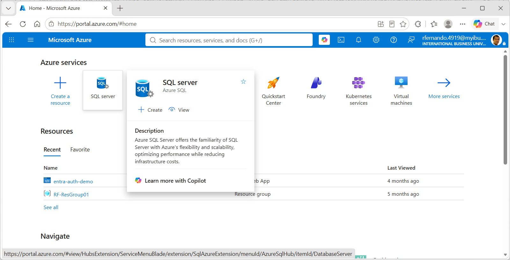
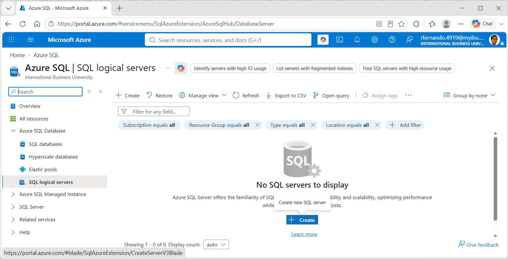
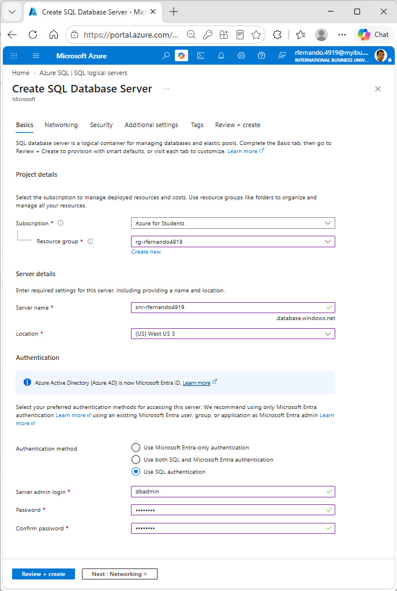
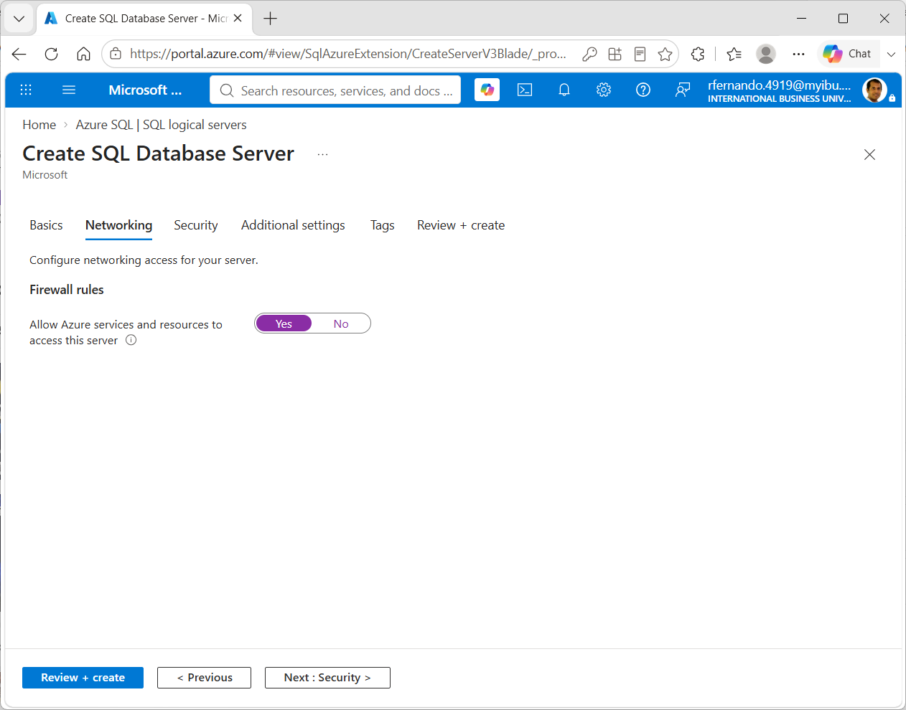
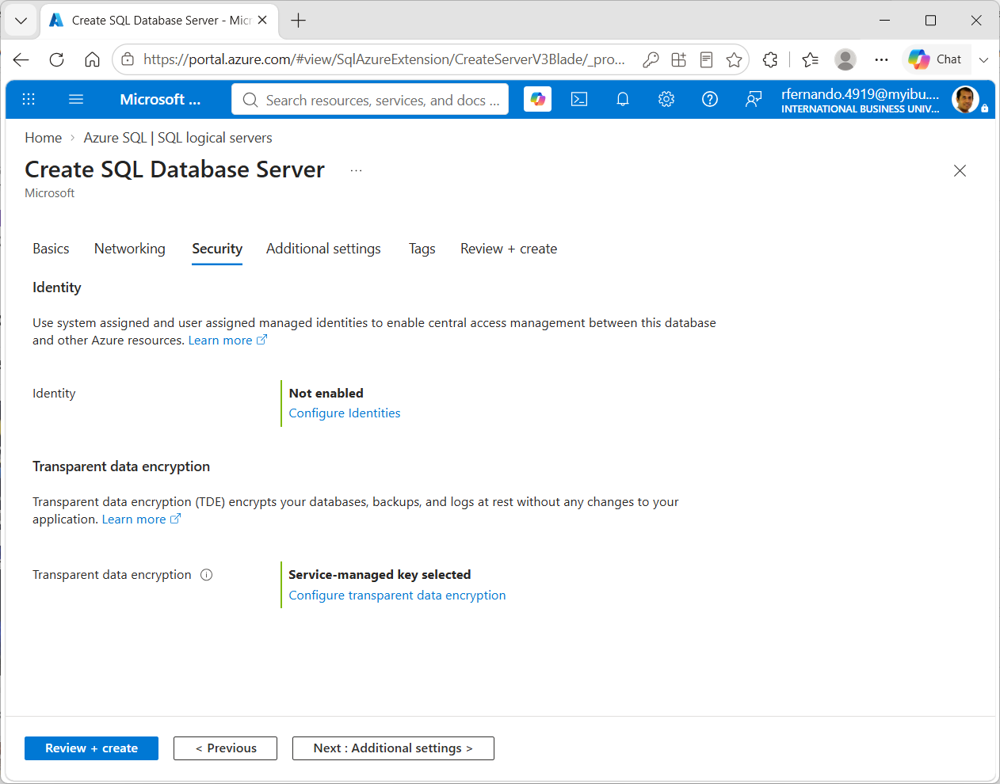
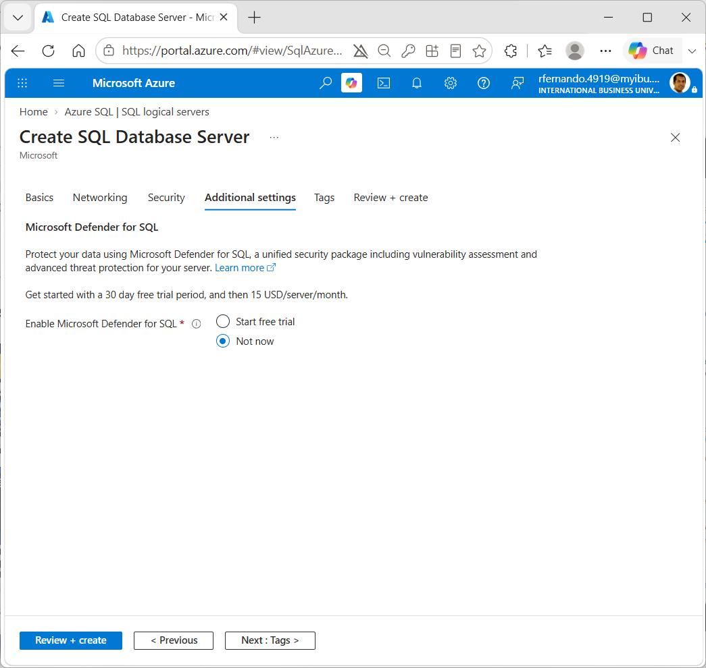
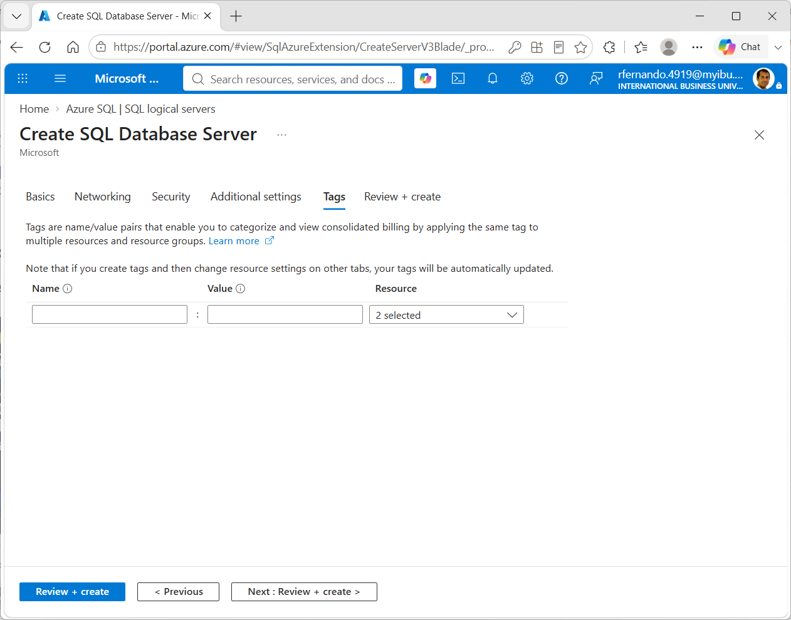
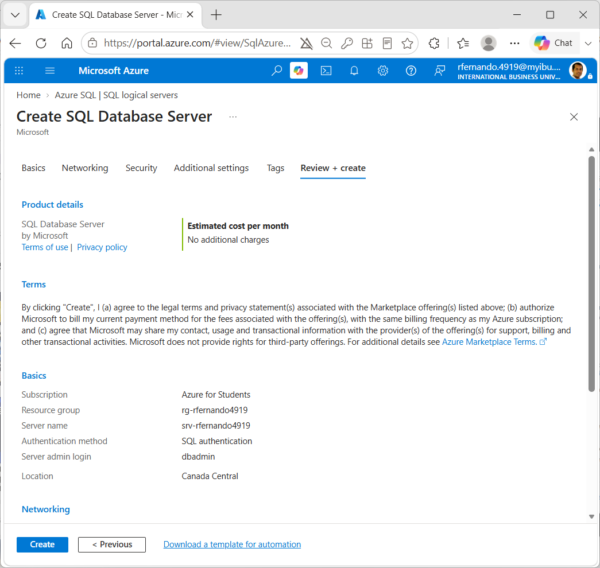
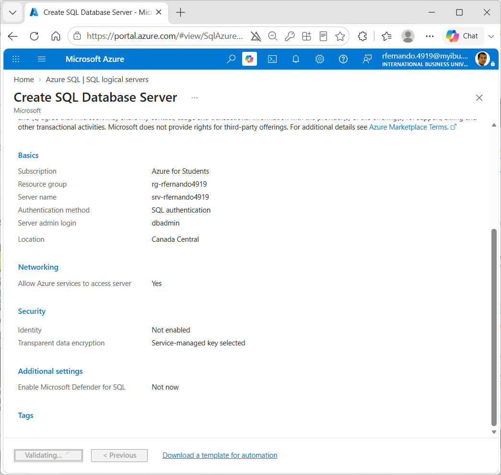
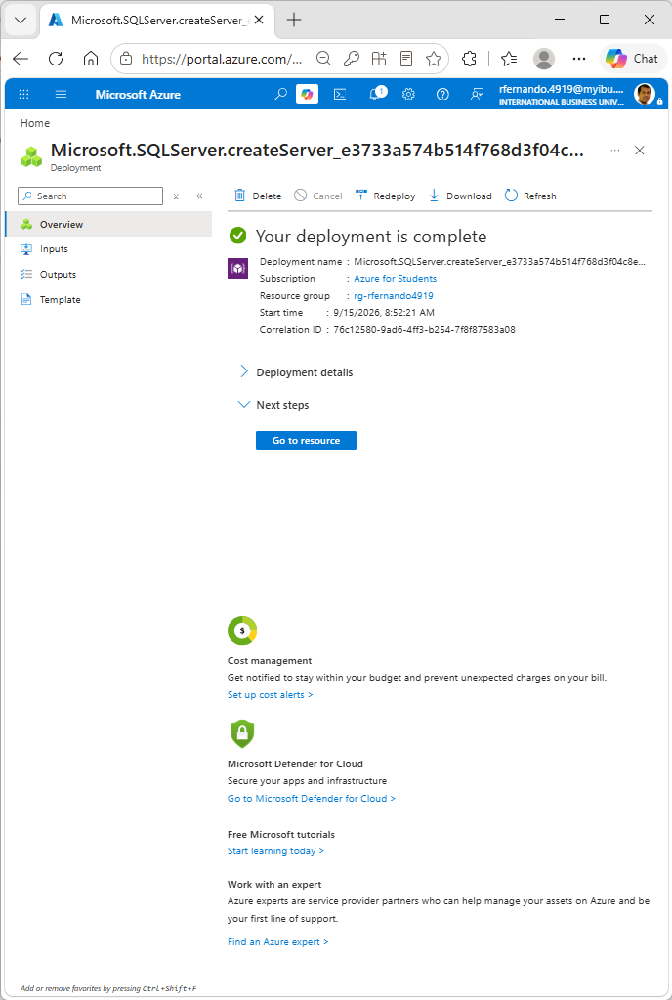

# Create a SQL Server instance on Microsoft Azure

Note: this is an optional step that you can try on your own free of charge using the Microsoft Azure subscription that you get through IBU. In the step-by-step instructions here, where any name contains the string `"jsmith1234"`, replace it with your own unique name stem by taking your IBU email and removing the "." and the "@ibu.ca" from it.

1. Login to [https://portal.azure.com](https://portal.azure.com) with your IBU student credentials and select SQL Server from the list of available services.

2. Expand `All Resources` > `Azure SQL Database` > `SQL logical servers` and click on `Create`.

3. Pick the following options:
    1. select `Azure for Students` as the subscription
    1. create a new Resource Group `rg-jsmith1234`)
    1. name the server `srv-jsmith1234`
    1. pick `US West 3` for the location (note: you might have to pick a different US or Canadian location)
    1. for authentication, select `Use SQL authentication`
    1. pick `dbadmin` as your server admin login, and pick a password.

4. In the next step, choose `Yes` in the Firewall rules screen.

5. In the next step, `Security`, you can leave the default options.

6. In the next step, `Additional settings`, select `Not now`.

7. In the next step, `Tags`, you can leave it empty.

8. In the final step, check and confirm the settings.

9. Wait for the validation step to complete

10. Once the validation and deployment is complete, click on `Go to resource`.
